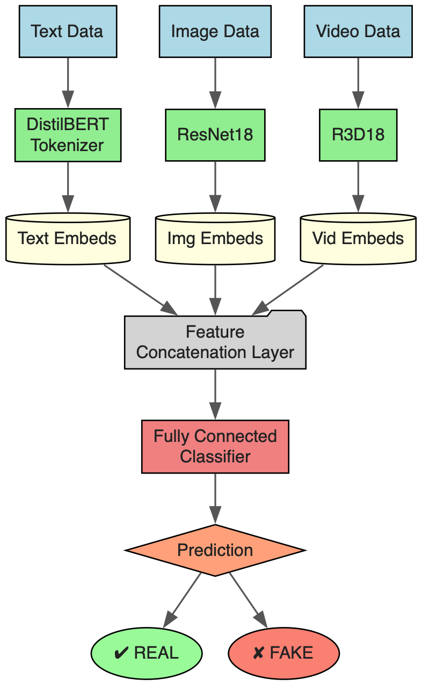

# Multi-Modal Fake News Detection

A prototype system for detecting real vs. fake news by combining text, image and video analysis in a single pipeline. Built in Google Colab (and runnable locally), it ingests URLs or local files—Instagram posts, YouTube links, web articles, images and videos—extracts content automatically, and issues real-time “REAL” / “FAKE” predictions via two complementary inference engines:  

1. **PyTorch Classifier**  
   - Text: DistilBERT tokenizer + encoder  
   - Images: fine-tuned ResNet-18 backbone  
   - Video: R3D-18 3D-CNN feature extractor  
   - Fusion: concatenation of modality embeddings + final FC head  

2. **LLM Second Opinion**  
   - Prompts routed to Google’s Gemini 1.5 Flash via LangChain  
   - Returns a binary decision plus a natural-language rationale  

---

## 🔍 Key Features

- **Live URL Extraction**  
  - Instagram via Instaloader (with HTML fallback)  
  - News articles via newspaper3k  
  - YouTube transcript support planned  
- **Multi-Modal Fusion**  
  Combines semantic, visual and temporal cues for robust classification  
- **Real-Time Inference**  
  Interactive prompts for URLs or local files, with instant feedback  
- **Comprehensive Evaluation**  
  Precision, recall, F1-score and overall accuracy (e.g. 91.4%) via `sklearn.metrics`  

## Architecture Diagram

Here’s how our model works:

